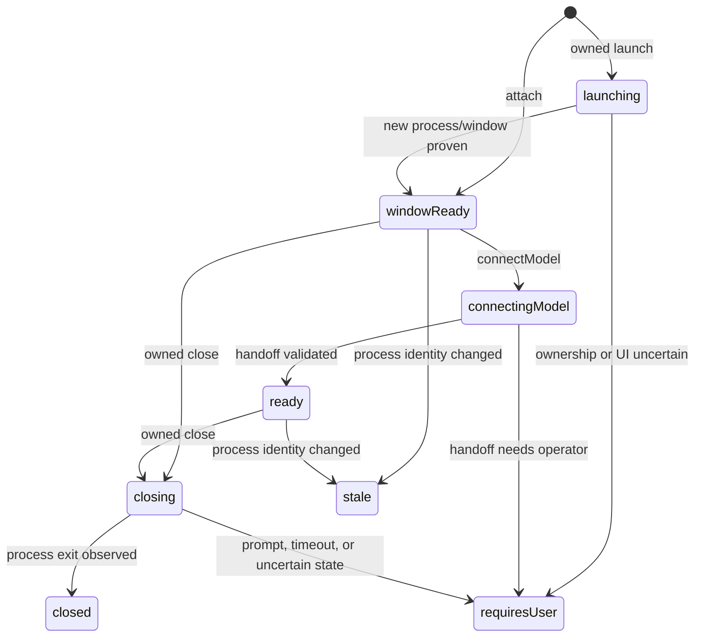

# Power BI Desktop Operator Specification

Status: **draft**

Target: first safe implementation slice for Power BI Desktop document lifecycle,
screenshots, data refresh, and bounded DAX queries through Windows Operator REST
and MCP.

Current implementation status: **not implemented**. Generic window screenshots
exist, but no Power BI namespace, session owner, document lifecycle, refresh
operation, model connection, DAX contract, capability, or MCP tool exists.

## Source Basis

This document becomes the governing human-readable source for Power BI Desktop
operator behavior when accepted. Executable Core contracts, OpenAPI, operation
policy, and tests govern exact implemented shapes after implementation.

| Source | Rank | Use |
| --- | --- | --- |
| This specification | Governing | Power BI Desktop product behavior, boundaries, contracts, and proof requirements |
| [`AGENTS.md`](../AGENTS.md) | Governing | Host/Agent ownership, public API direction, deep-module rules, Windows proof requirement |
| [`feature-namespaces.md`](feature-namespaces.md) | Governing | REST, MCP, contract, service, state, and feature-registration conventions |
| [`operator-harness-architecture.md`](operator-harness-architecture.md) | Governing | Host, Agent, external-consumer, and trust boundaries |
| [`operator-error-codes.md`](operator-error-codes.md) | Governing | Stable public error envelope and category vocabulary |
| Current screenshot, workbench, Host proxy, and MCP implementation | Supporting | Reusable mechanisms and implementation trace targets; not evidence that Power BI behavior exists |
| Microsoft Power BI and Analysis Services documentation linked below | Supporting external authority | Supported Desktop model connection, query, and refresh constraints |
| `openapi/windows-operator.openapi.json` | Generated | Implemented public contract projection; update only through its generator |
| `.work/` roadmaps | Non-governing | Campaign sequencing; no Power BI product authority |

No active source conflicts were found. Current implementation absence is a
design and enforcement gap, not contradictory behavior.

## Goal

Let an AI runtime or external application:

1. identify and attach to one running Power BI Desktop instance, or launch one
   allowlisted local PBIX as an operator-owned session;
2. save or gracefully close only an operator-owned document through explicit,
   fail-closed lifecycle operations;
3. capture its current application window as an opaque artifact;
4. start and observe a manual Desktop data refresh without duplicate refreshes;
5. execute bounded, query-only DAX against its loaded semantic model; and
6. do so without learning HWNDs, process IDs, raw document paths, local Analysis
   Services ports, model GUIDs, workspace paths, or Windows state layout.

## Non-goals

- Power BI Service, Fabric, XMLA endpoint, dataset REST API, report export API,
  gateway, tenant, capacity, or cloud authentication support.
- Creating, publishing, Save As, or PBIP lifecycle.
- Saving or closing a user-owned attached Power BI Desktop process.
- Discarding unsaved changes or forcibly terminating any Power BI Desktop
  process.
- Launching a PBIX from a URI, UNC path, path outside configured roots, or path
  that escapes an allowed root through a reparse point.
- Report page selection, visual selection, visual-only capture, PDF export, or
  pixel-coordinate interaction.
- DAX authoring assistance, query optimization, metadata mutation, TOM writes,
  TMSL/XMLA commands, processing commands, or model refresh through Analysis
  Services.
- Arbitrary discovery of local model ports by scraping Power BI workspace files
  or process command lines.
- Proof that every source row changed after refresh. V1 proves observed Power BI
  refresh completion and can use a caller's later DAX query for domain-specific
  verification.

Power BI Service support requires a separate specification and namespace. It
must not silently replace Desktop behavior behind these contracts.

## Search Anchors

Domain and user labels:

- `Power BI Desktop`
- `powerbi.desktop`
- `powerbi_desktop`
- `PowerBiDesktop`
- `DAX`
- `External Tools`
- `semantic model`

Target service and contracts:

- `IPowerBiDesktopService`
- `PowerBiDesktopInstanceResult`
- `PowerBiDesktopSessionStartRequest`
- `PowerBiDesktopSessionResult`
- `PowerBiDesktopDocumentRef`
- `PowerBiDesktopSaveRequest`
- `PowerBiDesktopSaveResult`
- `PowerBiDesktopCloseRequest`
- `PowerBiDesktopCloseResult`
- `PowerBiDesktopScreenshotRequest`
- `PowerBiDesktopScreenshotResult`
- `PowerBiDesktopRefreshRequest`
- `PowerBiDesktopRefreshResult`
- `PowerBiDesktopDaxQueryRequest`
- `PowerBiDesktopDaxQueryResult`

Primary implementation traces:

- `src/WindowsOperator.Core/Contracts/`
- `src/WindowsOperator.Core/Services/IPowerBiDesktopService.cs`
- `src/WindowsOperator.Agent/Services/PowerBiDesktopService.cs`
- `src/WindowsOperator.Agent/Api/OperatorEndpoints.cs`
- `src/WindowsOperator.Host/Services/DesktopAgentClient.cs`
- `src/WindowsOperator.Host/Api/HostOperatorEndpoints.cs`
- `src/WindowsOperator.Mcp/Protocol/McpToolCatalog.cs`
- `src/WindowsOperator.Core/Contracts/OperatorOpenApi.cs`
- `openapi/windows-operator.operation-policy.json`

## Users And Workflows

### AI runtime

1. List Power BI Desktop instances.
2. Start a caller-keyed session by attaching to one opaque instance or launching
   one allowlisted local PBIX.
3. Capture current report-window evidence, refresh data, or execute DAX.
4. Poll refresh by `refreshId` until terminal.
5. Save or gracefully close only if the session reports `ownership=owned`.
6. Clean operator session state.

### External application

Use Host REST on loopback or an explicitly allowlisted authenticated relay.
Discover capability and OpenAPI namespace before calling Power BI operations.

### Interactive operator

Install the Windows Operator entry under Power BI Desktop External Tools during
machine bootstrap. If automated External Tools activation is unavailable,
manually select **Windows Operator Connect** while the requested session is
pending.

## Architecture And Ownership

```text
AI runtime / external application
  -> Host REST or MCP, 127.0.0.1:43117
  -> DesktopAgentClient proxy
  -> Agent IPowerBiDesktopService, 127.0.0.1:43119
       -> allowlisted PBIX launch and ownership correlation
       -> owned-document save and graceful close state machines
       -> Power BI process/window observation
       -> registered External Tool handoff
       -> ADOMD.NET query connection
       -> UI Automation refresh orchestration
       -> existing screenshot and artifact services
  -> attached user-owned or operator-launched Power BI Desktop instance
```

Host owns:

- stable public REST/OpenAPI;
- MCP catalog and schemas;
- capability projection;
- public error translation; and
- relay exposure policy.

Agent owns:

- Power BI instance and session correlation;
- allowlisted document launch and process-lifetime ownership proof;
- owned-document save and graceful close;
- interactive UI activation and refresh;
- External Tools handoff acceptance;
- transient local Analysis Services connection state;
- DAX execution and bounds;
- screenshot composition; and
- local session and lifecycle-operation idempotency state.

`IPowerBiDesktopService` belongs in Core. Its implementation belongs in Agent.
`DesktopAgentClient` implements the Host proxy. `McpToolCatalog` receives the
specialized service directly; Power BI methods do not expand
`IOperatorFacade`.

The existing screenshot and artifact services remain mechanism owners.
`PowerBiDesktopService` composes them and does not duplicate Win32 capture or
artifact-path logic.

Power BI lifecycle does not use `OwnedSessionRegistry.CleanupSession`. That
generic cleanup may terminate a process after window-close failure; Power BI
document state makes that fallback unsafe. The specialized service owns its
launch, save, close, and recovery rules. Generic session cleanup only detaches
operator state.

## External Tool Model Handoff

Power BI Desktop starts an internal Analysis Services process with a dynamic
port and model identifier. Microsoft supports passing `%server%` and
`%database%` to a registered External Tool:

- [External tools in Power BI Desktop](https://learn.microsoft.com/en-us/power-bi/transform-model/desktop-external-tools)
- [Register an external tool](https://learn.microsoft.com/en-us/power-bi/transform-model/desktop-external-tools-register)

V1 machine bootstrap shall register **Windows Operator Connect** as a Power BI
Desktop External Tool. After attach or owned launch reaches `windowReady`,
session start with `connectModel=true` shall:

1. reserve the caller's `sessionId` against one opaque `instanceId`;
2. activate that Power BI window;
3. invoke the registered tool through the External Tools UI;
4. accept the server/database handoff through same-user local IPC;
5. correlate the handoff to the pending Power BI process and process start time;
6. validate a query connection; and
7. retain connection parameters in memory only.

The short-lived External Tool invocation may use an alternate Agent executable
mode. It is a handoff helper, not another long-running service or public
boundary.

IPC shall be restricted to the current interactive user. Agent shall accept a
handoff only for a pending session and matching process identity. Server,
database, connection strings, and query text shall not enter routine logs,
exchange artifacts, session files, API results, or error details.

If automated UI activation fails, session state becomes `requiresUser`. A user
may manually select **Windows Operator Connect** for the pending target. V1
shall not fall back to workspace-file, port-file, process-command-line, or broad
localhost-port discovery.

## Public REST Contract

Namespace: `powerbi.desktop`

All routes are Host-public and Agent-backed.

| Method | Path | Operation ID | Purpose |
| --- | --- | --- | --- |
| `GET` | `/v1/powerbi/desktop/instances` | `listPowerBiDesktopInstances` | List observable Power BI Desktop instances |
| `POST` | `/v1/powerbi/desktop/sessions` | `startPowerBiDesktopSession` | Attach to an instance or launch an allowlisted PBIX |
| `GET` | `/v1/powerbi/desktop/sessions/{sessionId}` | `getPowerBiDesktopSession` | Read and revalidate session state |
| `POST` | `/v1/powerbi/desktop/sessions/{sessionId}/saves` | `startPowerBiDesktopSave` | Save an operator-owned document |
| `GET` | `/v1/powerbi/desktop/sessions/{sessionId}/saves/{saveId}` | `getPowerBiDesktopSave` | Read save status |
| `POST` | `/v1/powerbi/desktop/sessions/{sessionId}/closes` | `startPowerBiDesktopClose` | Gracefully close an operator-owned document |
| `GET` | `/v1/powerbi/desktop/sessions/{sessionId}/closes/{closeId}` | `getPowerBiDesktopClose` | Read close status |
| `POST` | `/v1/powerbi/desktop/sessions/{sessionId}/screenshots` | `capturePowerBiDesktopScreenshot` | Capture whole application window |
| `POST` | `/v1/powerbi/desktop/sessions/{sessionId}/refreshes` | `startPowerBiDesktopRefresh` | Reserve and start one data refresh |
| `GET` | `/v1/powerbi/desktop/sessions/{sessionId}/refreshes/{refreshId}` | `getPowerBiDesktopRefresh` | Read refresh status |
| `POST` | `/v1/powerbi/desktop/sessions/{sessionId}/queries/dax` | `executePowerBiDesktopDaxQuery` | Execute bounded query-only DAX |
| `POST` | `/v1/powerbi/desktop/sessions/{sessionId}/cleanup` | `cleanupPowerBiDesktopSession` | Detach operator state without closing Power BI |

All route identifiers follow existing safe path-segment rules.

### Instance result

```json
{
  "instanceId": "opaque-process-lifetime-id",
  "reportTitle": "Sales Dashboard - Power BI Desktop",
  "isForeground": true,
  "isMinimized": false,
  "observedAtUtc": "2026-07-25T12:00:00Z"
}
```

`instanceId` is stable only for one process lifetime. Public results omit HWND,
process ID, process start time, class name, executable path, workspace path,
model endpoint, and database identifier.

### Session start

Attach request:

```json
{
  "sessionId": "sales-dashboard",
  "mode": "attach",
  "instanceId": "opaque-process-lifetime-id",
  "runId": "sales-dashboard",
  "connectModel": true
}
```

Launch request:

```json
{
  "sessionId": "sales-dashboard",
  "mode": "launch",
  "document": {
    "kind": "localPbix",
    "path": "C:\\Allowed\\Sales.pbix"
  },
  "runId": "sales-dashboard",
  "connectModel": true
}
```

`mode` is a discriminator. `attach` requires `instanceId` and rejects
`document`; `launch` requires `document` and rejects `instanceId`. Both or
neither selectors return `invalid_request`.

V1 launch accepts one existing local `.pbix` whose canonical resolved path is
under a configured allowed root. It rejects URIs, UNC paths, PBIP directories,
other extensions, missing files, and reparse-point escapes. Request-body logs
redact `document.path`. Responses, errors, telemetry, and persisted state never
contain the raw path.

Agent durably reserves a launch `(sessionId, document identity)` before starting
Power BI. Repeating the same request returns or reconciles the reservation and
never starts another process. Repeating `sessionId` with another selector
returns conflict.

Launch ownership requires a newly observed process and window causally tied to
the reservation. A document detected open before launch returns
`powerbi_document_in_use`. If Power BI unexpectedly reuses an existing process
or ownership cannot be proved, Agent returns `powerbi_ownership_unproven`; it
never upgrades that process to operator-owned.

```json
{
  "success": true,
  "sessionId": "sales-dashboard",
  "status": "ready",
  "ownership": "owned",
  "document": {
    "documentId": "opaque-document-id",
    "name": "Sales.pbix",
    "kind": "pbix"
  },
  "reportTitle": "Sales Dashboard - Power BI Desktop",
  "isAlive": true,
  "windowAvailable": true,
  "modelAvailable": true,
  "createdAtUtc": "2026-07-25T12:00:00Z",
  "observedAtUtc": "2026-07-25T12:00:03Z",
  "actions": ["session_launched", "model_connected"],
  "warnings": []
}
```

Session status vocabulary:

```text
launching
windowReady
connectingModel
ready
requiresUser
closing
stale
closed
unavailable
```

`ready` means window and model query connection validated. `windowReady` means
screenshot and refresh may proceed, but DAX is unavailable. Every operation
revalidates process lifetime identity. Stale state never silently rebinds to
another instance. `ownership` is `attached` or `owned`; it is authorization
state, not a title-based inference. `documentId` is opaque and stable only for
the bound document lifetime.

In V1, Agent restart invalidates lifecycle authority. A surviving Power BI
process becomes unmanaged and attachable, never implicitly owned. Its prior
session reports `requiresUser` or a typed ownership error; save and close
remain unavailable.

Lifecycle:



Only process exit proves `closed`. Window disappearance alone yields
`unavailable`, `requiresUser`, or an in-progress close result until process
identity resolves.

### Save

```json
{
  "saveId": "save-20260725-01",
  "expectedDocumentId": "opaque-document-id",
  "allowDocumentMutation": true
}
```

Save requires a live `ownership=owned` session, exact document identity, and
explicit mutation permission. Agent durably reserves `(sessionId, saveId)`
before issuing a save action. Repeating a reserved ID returns its operation and
never issues another save action. Reusing that ID with different document or
permission fields returns `powerbi_session_conflict`.
`allowDocumentMutation=false` or omission returns `invalid_request` before
reservation.

Result:

```json
{
  "success": true,
  "sessionId": "sales-dashboard",
  "saveId": "save-20260725-01",
  "status": "saved",
  "startedAtUtc": "2026-07-25T12:20:00Z",
  "completedAtUtc": "2026-07-25T12:20:02Z",
  "completionEvidence": "targetFileMutation",
  "actions": ["save_reserved", "save_started", "save_verified"],
  "warnings": []
}
```

Save status vocabulary:

```text
accepted
running
saved
noChanges
failed
requiresUser
unknown
```

`saved` requires observed target-file mutation or a reliable clean-state signal.
`noChanges` requires a reliable clean-state signal; unchanged timestamps alone
do not prove it. If save completion cannot be proved, status becomes
`requiresUser` or `unknown` with `powerbi_save_unverified`. Attached sessions
return `powerbi_session_ownership_required`.

### Close

```json
{
  "closeId": "close-20260725-01",
  "expectedDocumentId": "opaque-document-id",
  "saveBehavior": "save",
  "allowDocumentMutation": true
}
```

`saveBehavior` is `save` or `failIfDirty`; omission resolves to
`failIfDirty`. `save` requires `allowDocumentMutation=true` and proceeds to
close only after save proof. `failIfDirty` requires mutation permission to be
false or omitted and proves clean state before initiating close. Dirty or
unprovable state returns `requiresUser` with
`powerbi_dirty_state_unknown` or `powerbi_close_blocked`; it does not initiate
close and does not rely on a Power BI prompt as the guard.

Close status vocabulary:

```text
accepted
running
closed
failed
requiresUser
unknown
```

Close requires a live `ownership=owned` session and exact document identity.
V1 exposes no discard behavior. Close is graceful only; prompt, timeout, or
uncertain process identity never falls back to process termination. The generic
owned-session forced cleanup path is unreachable from all Power BI routes and
tools. Agent durably reserves `(sessionId, closeId)` before save or close
action. Reuse with different document, behavior, or permission fields returns
`powerbi_session_conflict`.

Result:

```json
{
  "success": true,
  "sessionId": "sales-dashboard",
  "closeId": "close-20260725-01",
  "status": "closed",
  "saveId": "save-for-close-20260725-01",
  "startedAtUtc": "2026-07-25T12:25:00Z",
  "completedAtUtc": "2026-07-25T12:25:04Z",
  "completionEvidence": "processExit",
  "actions": ["close_reserved", "save_verified", "close_started", "process_exited"],
  "warnings": []
}
```

### Screenshot

```json
{
  "runId": "sales-dashboard",
  "label": "after-refresh",
  "format": "png"
}
```

Result:

```json
{
  "success": true,
  "sessionId": "sales-dashboard",
  "reportTitle": "Sales Dashboard - Power BI Desktop",
  "artifact": {
    "artifactId": "opaque-id",
    "href": "/v1/artifacts/opaque-id",
    "mediaType": "image/png",
    "bytes": 123456,
    "sha256": "..."
  },
  "pixelWidth": 1600,
  "pixelHeight": 900,
  "backend": "PrintWindow",
  "capturedAtUtc": "2026-07-25T12:05:00Z",
  "warnings": []
}
```

V1 captures the whole visible application window. Service may activate Power BI
before capture and does not promise foreground restoration. Minimized,
unpresentable, or blank capture returns a typed error. Each successful call
creates a new artifact and is not idempotent.

### Refresh

```json
{
  "refreshId": "refresh-20260725-01"
}
```

Agent durably reserves `(sessionId, refreshId)` before initiating UI action.
Only one refresh may run per session. Repeating a reserved `refreshId` returns
its existing record and never initiates another refresh.

Result:

```json
{
  "success": true,
  "sessionId": "sales-dashboard",
  "refreshId": "refresh-20260725-01",
  "status": "running",
  "startedAtUtc": "2026-07-25T12:10:00Z",
  "completedAtUtc": null,
  "completionEvidence": null,
  "actions": ["refresh_reserved", "refresh_started"],
  "warnings": []
}
```

Refresh status vocabulary:

```text
accepted
running
succeeded
failed
requiresUser
unknown
```

`succeeded` means Agent observed refresh activity start, then observed Power BI
return to a terminal non-error refresh state. It does not assert domain data
changed. Credential, privacy-level, native-database-query, or other prompts
produce `requiresUser`. Agent restart during an in-flight refresh produces
`unknown`; it never automatically repeats the UI action.

Refresh shall use Power BI Desktop UI behavior. It shall not send processing
commands to the local model. Microsoft distinguishes Desktop ribbon refresh
from Service refresh and does not support processing commands against a model
loaded in Desktop:

- [Refresh in Power BI Desktop versus Power BI Service](https://learn.microsoft.com/en-us/power-bi/connect-data/refresh-desktop-file-local-drive)
- [External tool processing limitation](https://learn.microsoft.com/en-us/power-bi/transform-model/desktop-external-tools#data-modeling-operations)

### DAX query

```json
{
  "query": "EVALUATE ROW(\"Probe\", 1)",
  "maxRows": 1000,
  "timeoutSeconds": 30
}
```

Server maxima:

- `maxRows`: `1000`
- serialized result: `4 MiB`
- `timeoutSeconds`: `30`

Caller values may lower but not raise these maxima.

Result:

```json
{
  "success": true,
  "sessionId": "sales-dashboard",
  "columns": [
    {
      "name": "[Probe]",
      "dataType": "int64"
    }
  ],
  "rows": [
    [1]
  ],
  "rowCount": 1,
  "truncated": false,
  "truncationReason": null,
  "durationMs": 12,
  "executedAtUtc": "2026-07-25T12:15:00Z",
  "warnings": []
}
```

Rows use column-order arrays. Values use JSON `null`, Boolean, integer, or
finite number when lossless. Decimal/currency values use invariant strings with
their column type. Date/time values use ISO 8601 strings. Other values use
strings. Result order follows the DAX result set; callers requiring order must
express it in DAX.

Agent uses current `Microsoft.AnalysisServices.AdomdClient` NuGet package.
Microsoft identifies ADOMD as the Analysis Services query client and recommends
NuGet delivery:

- [Analysis Services client libraries](https://learn.microsoft.com/en-us/analysis-services/client-libraries)

V1 accepts one result-set-producing DAX query. It does not accept XMLA, TMSL,
TOM, processing, metadata mutation, batch files, connection strings, server
names, or database identifiers. It does not shell out to DAX Studio.

DirectQuery models may contact external data sources during DAX execution.
Cancellation stops waiting and requests ADOMD cancellation; it does not promise
remote source rollback.

### Cleanup

Cleanup releases operator session binding, model connection, and transient
state. Durable lifecycle reservations remain long enough to prevent duplicate
launch/save/close action after retry. Cleanup does not close Power BI Desktop,
save files, alter the model, delete evidence artifacts, or affect other
sessions. This detach-only rule applies to attached and owned sessions.
Repeated cleanup returns `closed`.

## MCP Contract

MCP schemas mirror Core REST request/result contracts and return complete JSON
through `structuredContent`.

| Tool | REST operation | Read-only | Destructive | Open-world | Idempotent |
| --- | --- | --- | --- | --- | --- |
| `powerbi_desktop_list_instances` | List instances | true | false | false | true |
| `powerbi_desktop_session_start` | Start session | false | false | false | true |
| `powerbi_desktop_session_state` | Get session | true | false | false | true |
| `powerbi_desktop_save` | Start save | false | true | false | true with `saveId` |
| `powerbi_desktop_save_status` | Get save | true | false | false | true |
| `powerbi_desktop_close` | Start close | false | true | false | true with `closeId` |
| `powerbi_desktop_close_status` | Get close | true | false | false | true |
| `powerbi_desktop_screenshot` | Screenshot | false | false | false | false |
| `powerbi_desktop_refresh` | Start refresh | false | false | true | true with `refreshId` |
| `powerbi_desktop_refresh_status` | Get refresh | true | false | false | true |
| `powerbi_desktop_query_dax` | Execute DAX | true | false | true | true |
| `powerbi_desktop_session_cleanup` | Cleanup session | false | false | false | true |

`openWorld=true` for refresh because Power BI contacts configured sources.
It is also true for DAX because DirectQuery execution may contact configured
sources.

Tool descriptions start with `Use this when...`. Compact text summaries omit
row values, DAX text, model identifiers, document paths, and connection
details. Save and close require the same ownership, document identity,
idempotency, proof, and no-force rules as REST.

## Capabilities

Host capability discovery adds:

```text
powerbi.desktop.session
powerbi.desktop.lifecycle
powerbi.desktop.screenshot
powerbi.desktop.refresh
powerbi.desktop.dax-query
```

Each feature reports its own dependencies. Session requires Desktop Agent and
an interactive desktop. Lifecycle additionally requires launch policy, allowed
roots, and lifecycle automation; its details expose `launchType=localPbix`,
`save=true`, `discard=false`, and `modelHandshake=externalTool`. Screenshot
requires a capture backend. Refresh requires supported UI automation. DAX
requires External Tool registration and ADOMD. Missing model-handshake support
does not disable window-only session, lifecycle, screenshot, or refresh
capabilities. Capability does not claim a running Power BI instance exists.

## Stable Errors

Public messages may evolve. Consumers branch on codes.

| Code | Category | Retryable | Meaning |
| --- | --- | --- | --- |
| `powerbi_instance_not_found` | `notFound` | true | Requested observed Desktop instance no longer exists |
| `powerbi_instance_ambiguous` | `conflict` | false | Selector resolved to more than one instance |
| `powerbi_document_not_found` | `notFound` | false | Requested local PBIX does not exist |
| `powerbi_document_not_allowed` | `permission` | false | Document kind or canonical path violates launch policy |
| `powerbi_document_in_use` | `conflict` | false | Requested document cannot be launched as a distinct owned instance |
| `powerbi_launch_failed` | `unavailable` | true | Power BI launch failed before ownership was established |
| `powerbi_launch_outcome_unknown` | `conflict` | false | Launch may have occurred, but retry cannot safely start another process |
| `powerbi_ownership_unproven` | `conflict` | false | Process/window ownership cannot be causally proved |
| `powerbi_session_not_found` | `notFound` | false | Caller session ID has no operator binding |
| `powerbi_session_conflict` | `conflict` | false | Session ID is already bound to another instance |
| `powerbi_session_ownership_required` | `permission` | false | Operation requires a live operator-owned session |
| `powerbi_session_stale` | `conflict` | false | Bound process lifetime ended or identity changed |
| `powerbi_document_identity_mismatch` | `conflict` | false | Expected document does not match the live owned document |
| `powerbi_operation_in_progress` | `conflict` | true | Another mutating operation owns the session |
| `powerbi_external_tool_not_registered` | `unavailable` | false | Supported model handoff is not installed |
| `powerbi_model_unavailable` | `unavailable` | true | Model handoff or validated ADOMD connection is unavailable |
| `powerbi_user_action_required` | `unavailable` | false | Power BI requires interactive operator input |
| `powerbi_save_not_found` | `notFound` | false | Save ID was not reserved for this session |
| `powerbi_save_failed` | `unavailable` | true | Power BI reported or exposed a save failure |
| `powerbi_save_unverified` | `conflict` | false | Save completion or clean state cannot be proved |
| `powerbi_dirty_state_unknown` | `conflict` | false | Clean state cannot be proved, so close was not initiated |
| `powerbi_close_not_found` | `notFound` | false | Close ID was not reserved for this session |
| `powerbi_close_blocked` | `conflict` | false | Dirty state, prompt, or save proof blocks safe close |
| `powerbi_close_timeout` | `timeout` | true | Graceful close did not reach observed process exit |
| `powerbi_refresh_in_progress` | `conflict` | true | Another refresh owns the session |
| `powerbi_refresh_not_found` | `notFound` | false | Refresh ID was not reserved for this session |
| `powerbi_refresh_failed` | `unavailable` | true | Power BI reported refresh failure |
| `powerbi_query_invalid` | `validation` | false | Input is not an accepted query-only DAX request |
| `powerbi_query_limit_exceeded` | `validation` | false | Caller requested a value above a server maximum |
| `powerbi_query_timeout` | `timeout` | true | DAX exceeded bounded execution time |

Existing `locked_desktop`, `minimized_rdp`, `blank_capture`,
`elevated_target`, `uipi_blocked`, `invalid_request`, and `internal_error`
remain reusable where their meanings match.

Internal exception types, UI names, ports, database identifiers, paths, and DAX
text never appear in public error details.

## State And Security

Session and lifecycle-operation metadata belongs under:

```text
%LOCALAPPDATA%\WindowsOperator\run\powerbi-desktop\
```

Persist only:

- session ID;
- opaque instance correlation needed to detect stale process lifetime;
- opaque document ID, document leaf name, and keyed canonical-path identity;
- attach/owned classification and launch reservation;
- report title;
- run ID;
- timestamps;
- status;
- launch, save, close, and refresh IDs with observed transitions;
- process-lifetime correlation required for recovery; and
- non-sensitive action/warning codes.

Never persist:

- raw or reversible PBIX path;
- Analysis Services server or port;
- database/model GUID;
- connection string;
- DAX text;
- DAX rows;
- source credentials; or
- raw UI dialog text that may contain secrets.

Routine telemetry logs operation name, correlation ID, session ID, query SHA-256
hash, duration, row count, truncation, and outcome. It does not log query text
or result values. Raw PBIX path is also excluded from HTTP response bodies, MCP
output, structured exception data, telemetry, request-body logs, and persisted
state. A path hash used for correlation must be keyed or otherwise resistant to
offline path enumeration.

Agent stores the raw launch path in memory only. On Agent restart, in-flight
launch, save, close, or refresh becomes `unknown` when terminal outcome cannot
be proved. A launch reservation with uncertain outcome becomes
`powerbi_launch_outcome_unknown`; retry reconciles observation and never starts
another process. Restart never restores save/close authority solely from
persisted state. V1 requires the surviving process to be attached as
user-owned.

One mutating operation may own a session at a time: launch/model connection,
refresh, save, or close. Save and close reject while refresh runs. DAX rejects
during refresh, save, or close. Screenshot may run for evidence when the window
is presentable. Close blocks all new operations except close-status and session
state.

Power BI routes remain loopback-only. External relay exposure is denied by
default until route-specific authentication, allowlisting, response-size
limits, and data-handling review exist. DAX results are returned inline and are
not written to exchange storage. Screenshots use existing opaque artifact
contracts and retention policy.

## Requirements

`REQ powerbi.desktop.instance.discover`: WHEN Power BI Desktop instances are
observable, THE SYSTEM SHALL return one opaque process-lifetime identity per
instance without exposing Windows or model connection internals.

`REQ powerbi.desktop.session.attach`: WHEN a caller supplies a unique
`sessionId` and valid `instanceId`, THE SYSTEM SHALL create or return the same
attach-only session and revalidate the target identity.

`REQ powerbi.desktop.lifecycle.launch`: WHEN a caller supplies a valid launch
request, THE SYSTEM SHALL reserve the request before launching one local PBIX
and SHALL return an owned session only after causal process/window ownership is
proved.

`REQ powerbi.desktop.lifecycle.path-policy`: WHEN a launch path is evaluated,
THE SYSTEM SHALL canonicalize it, require an existing `.pbix` under a configured
allowed root, reject URI/UNC/PBIP/reparse escapes, and redact the raw path from
all durable and public surfaces.

`REQ powerbi.desktop.lifecycle.ownership`: WHEN Power BI reuses an existing
process, process identity is uncertain, or Agent restart invalidates authority,
THE SYSTEM SHALL fail closed and SHALL NOT authorize save or close.

`REQ powerbi.desktop.lifecycle.idempotency`: WHEN launch, save, or close accepts
an operation ID, THE SYSTEM SHALL persist its reservation before external
action and SHALL NOT repeat uncertain external action after retry or restart.

`REQ powerbi.desktop.lifecycle.save`: WHEN an owned session receives explicit
mutation permission and matching document identity, THE SYSTEM SHALL issue at
most one save and SHALL report success only from reliable file-mutation or
clean-state proof.

`REQ powerbi.desktop.lifecycle.close`: WHEN an owned session receives matching
document identity and `save` or `failIfDirty`, THE SYSTEM SHALL initiate
graceful close only after required clean/save proof and SHALL report `closed`
only after observing process exit.

`REQ powerbi.desktop.lifecycle.restart`: WHEN Agent restarts, THE SYSTEM SHALL
mark uncertain lifecycle operations unknown, invalidate unproved ownership
authority, and treat a surviving Power BI process as attachable rather than
implicitly owned.

`REQ powerbi.desktop.lifecycle.no-force`: WHEN close is blocked, prompts, times
out, or remains uncertain, THE SYSTEM SHALL return typed nonterminal/failure
state and SHALL NOT discard changes or terminate the process.

`REQ powerbi.desktop.session.ownership`: WHEN an attached session or cleanup
operation is handled, THE SYSTEM SHALL release only operator binding state and
SHALL NOT close, save, or mutate the Power BI process or file.

`REQ powerbi.desktop.session.stale`: IF the bound process lifetime changes, THE
SYSTEM SHALL return `powerbi_session_stale` and SHALL NOT bind another process
implicitly.

`REQ powerbi.desktop.model.handshake`: WHEN model connection is requested, THE
SYSTEM SHALL use the registered Power BI External Tool handoff and SHALL NOT
discover endpoints through workspace, process-command-line, or port scanning.

`REQ powerbi.desktop.screenshot.capture`: WHEN a live presentable session
requests capture, THE SYSTEM SHALL return a nonblank whole-window artifact with
dimensions, media metadata, checksum, backend, and timestamp.

`REQ powerbi.desktop.refresh.execute`: WHEN a new valid `refreshId` is accepted,
THE SYSTEM SHALL reserve it before initiating Power BI Desktop's UI refresh and
SHALL serialize refreshes per session.

`REQ powerbi.desktop.refresh.idempotency`: WHEN a caller repeats
`(sessionId, refreshId)`, THE SYSTEM SHALL return the reserved operation and
SHALL NOT initiate another refresh, including after Agent restart.

`REQ powerbi.desktop.refresh.observe`: WHEN refresh state changes, THE SYSTEM
SHALL expose accepted, running, succeeded, failed, requires-user, or unknown
state with observed timestamps and evidence classification.

`REQ powerbi.desktop.dax.query`: WHEN a ready model session receives valid
query-only DAX, THE SYSTEM SHALL execute it through ADOMD and return typed,
ordered, bounded rows without exposing connection details.

`REQ powerbi.desktop.dax.bounds`: IF row, byte, or time limits are reached, THE
SYSTEM SHALL truncate safely or return a typed limit/timeout error and SHALL
request cancellation.

`REQ powerbi.desktop.data.protect`: WHEN handling model connection data, DAX, or
results, THE SYSTEM SHALL keep transport loopback/private and SHALL exclude
sensitive values from routine logs, persisted state, artifacts, and errors.

`REQ powerbi.desktop.contract.parity`: WHEN a Power BI operation becomes
Host-public, THE SYSTEM SHALL provide matching Core types, Host and Agent
routes, OpenAPI, operation policy, MCP schema where listed, capability, error
documentation, and contract tests.

`REQ powerbi.desktop.error.stable`: WHEN a public Power BI operation fails, THE
SYSTEM SHALL return the documented `OperatorError` code, category, retryability,
and correlation ID without leaking internal mechanics.

`REQ powerbi.provider.isolate`: IF Power BI Service support is later added, THE
SYSTEM SHALL use a distinct provider namespace and service boundary rather than
changing Desktop contract semantics.

## Acceptance Criteria

`AC powerbi.instance.multiple`: Given two Power BI Desktop processes, listing
returns two distinct opaque IDs; session start targets the requested one; no
public response contains PID, HWND, port, model GUID, or workspace path.

`AC powerbi.session.idempotent`: Given one session binding, repeating start with
the same IDs returns the same session; using its `sessionId` for another
selector returns `powerbi_session_conflict`.

`AC powerbi.lifecycle.launch-owned`: Given an allowed local PBIX and no reusable
existing process, launch observes a newly correlated process/window and returns
`ownership=owned` with opaque `documentId`.

`AC powerbi.lifecycle.path-policy`: Given UNC, URI, PBIP, wrong-extension,
outside-root, or reparse-escape input, launch returns
`powerbi_document_not_allowed`; API, MCP, state, errors, and logs contain no raw
path.

`AC powerbi.lifecycle.launch-duplicate`: Given one durably reserved launch,
concurrent and later identical starts produce at most one OS launch action.

`AC powerbi.lifecycle.launch-crash`: Given Agent failure after launch
reservation and before ownership proof, retry returns or reconciles
`powerbi_launch_outcome_unknown` and does not launch another process.

`AC powerbi.lifecycle.process-reuse`: Given Power BI opens the requested PBIX in
an existing process, start returns `powerbi_ownership_unproven`; later save and
close remain forbidden.

`AC powerbi.lifecycle.save`: Given a live owned session, matching
`expectedDocumentId`, `allowDocumentMutation=true`, and changed document, one
save action produces observed target-file mutation and terminal `saved`.

`AC powerbi.lifecycle.save-unverified`: Given no reliable mutation or clean
signal, unchanged timestamp alone does not produce `saved` or `noChanges`;
operation returns `powerbi_save_unverified`, `requiresUser`, or `unknown`.

`AC powerbi.lifecycle.close-dirty`: Given `failIfDirty` and dirty or unprovable
state, close returns `powerbi_close_blocked` or
`powerbi_dirty_state_unknown` without initiating a close action.

`AC powerbi.lifecycle.close-save`: Given `saveBehavior=save`, close starts only
after save proof; missing save proof leaves Power BI open.

`AC powerbi.lifecycle.attached-denied`: Given `ownership=attached`, save and
close return `powerbi_session_ownership_required`; cleanup detaches and Power BI
remains open.

`AC powerbi.lifecycle.no-force`: Given graceful close prompt or timeout, status
becomes `requiresUser` or failed, the process remains alive, and no kill API or
generic forced-cleanup path executes.

`AC powerbi.lifecycle.closed-proof`: Given a disappearing window with a live
process, close does not report `closed`; observed process exit is required.

`AC powerbi.lifecycle.restart`: Given Agent restart with a surviving formerly
owned process, ownership authority is invalidated; process is listable and
attachable but save/close remain unavailable.

`AC powerbi.session.stale`: Given a bound Power BI process that exits and a new
process reuses visible title or PID, every operation rejects the old session
with `powerbi_session_stale`.

`AC powerbi.session.cleanup`: Given a live attached session, cleanup returns
`closed`; Power BI remains open; repeated cleanup remains successful.

`AC powerbi.model.supported-handoff`: Given installed registration and a pending
session, automated or manual **Windows Operator Connect** handoff produces
`modelAvailable=true`; no workspace/port discovery executes.

`AC powerbi.model.registration-missing`: Given absent registration, connection
returns `powerbi_external_tool_not_registered`; screenshot and refresh remain
available from a `windowReady` session.

`AC powerbi.screenshot.visible`: Given a visible non-minimized report window,
PNG capture returns a retrievable, checksum-valid, nonblank artifact with
positive dimensions.

`AC powerbi.screenshot.unpresentable`: Given minimized, locked, or blank
capture, operation returns the matching typed existing error and no successful
artifact result.

`AC powerbi.refresh.changed-fixture`: Given a fixture source whose value changes,
start refresh with a new ID, observe terminal success, then execute caller DAX
showing the changed value.

`AC powerbi.refresh.duplicate`: Given one reserved refresh ID, concurrent and
later identical calls produce one observed UI refresh action.

`AC powerbi.refresh.restart`: Given Agent restart during refresh, status becomes
`unknown`; retry with the same ID does not initiate another refresh.

`AC powerbi.refresh.requires-user`: Given a credential or privacy prompt,
status becomes `requiresUser` and includes no prompt secret.

`AC powerbi.dax.probe`: Given a ready model, `EVALUATE ROW("Probe", 1)` returns
one typed column and one row containing `1`.

`AC powerbi.dax.failures`: Invalid DAX, unavailable model, timeout, caller limit
above maximum, and stale session each return their documented typed errors.

`AC powerbi.dax.truncate`: Given more than 1,000 rows or 4 MiB output, response
stops within bounds and reports `truncated=true` with reason.

`AC powerbi.data.redaction`: Contract and live logs contain no DAX text, DAX
values, port, database GUID, connection string, source credential, raw PBIX
path, or internal path.

`AC powerbi.contract.parity`: OpenAPI namespace slice, generated Go client,
operation policy, MCP tool list/schema/result annotations, capabilities, and
error-code documentation agree for every implemented route.

## Traceability

| Requirement | Automated proof target | Live/manual proof |
| --- | --- | --- |
| `powerbi.desktop.instance.discover` | `PowerBiDesktopServiceTests`, `ContractSerializationTests` | Two-instance Windows fixture |
| `powerbi.desktop.session.attach` | `PowerBiDesktopServiceTests`, `DesktopAgentClientTests` | Bind/rebind live report |
| `powerbi.desktop.lifecycle.launch` | launcher, process-correlation, and contract tests | Launch allowlisted PBIX into distinct process/window |
| `powerbi.desktop.lifecycle.path-policy` | path canonicalization, reparse, redaction, and persistence tests | Allowed-root and rejection matrix |
| `powerbi.desktop.lifecycle.ownership` | process-reuse, identity, and restart tests | Existing-process reuse remains unmanaged |
| `powerbi.desktop.lifecycle.idempotency` | concurrency, durable-reservation, and crash-recovery tests | Same-ID launch/save/close yields one external action |
| `powerbi.desktop.lifecycle.save` | save state-machine, identity, and proof tests | Changed and unchanged owned PBIX fixtures |
| `powerbi.desktop.lifecycle.close` | close state-machine, dirty-state, and process-exit tests | Clean, dirty, prompted, and saved close fixtures |
| `powerbi.desktop.lifecycle.restart` | lifecycle recovery and authority-invalidation tests | Restart Agent with surviving Power BI process |
| `powerbi.desktop.lifecycle.no-force` | dependency and negative kill-path tests | Close timeout leaves Power BI process alive |
| `powerbi.desktop.session.ownership` | `PowerBiDesktopServiceTests` | Cleanup while report remains open |
| `powerbi.desktop.session.stale` | `PowerBiDesktopServiceTests` | Restart Desktop and reject old session |
| `powerbi.desktop.model.handshake` | helper-mode and IPC tests | Registered External Tool handoff |
| `powerbi.desktop.screenshot.capture` | `PowerBiDesktopServiceTests`, capture tests | Visible report PNG and negative minimized case |
| `powerbi.desktop.refresh.execute` | refresh state-machine tests | Source-changing refresh fixture |
| `powerbi.desktop.refresh.idempotency` | concurrency and restart tests | Same-ID repeat with one UI action |
| `powerbi.desktop.refresh.observe` | refresh transition tests | Success, failure, prompt, and timeout observations |
| `powerbi.desktop.dax.query` | ADOMD adapter and serialization tests | `EVALUATE ROW` plus model query |
| `powerbi.desktop.dax.bounds` | row/byte/time/cancellation tests | Large query and timeout fixture |
| `powerbi.desktop.data.protect` | serialization, state-file, and log-redaction tests | Inspect Windows state, exchange, and logs |
| `powerbi.desktop.contract.parity` | `RestAndMcpParityTests`, `McpToolCatalogTests`, `HostOperatorEndpointsTests`, OpenAPI scripts | Live Host REST and MCP calls |
| `powerbi.desktop.error.stable` | Agent/Host error handling and docs-check tests | Live negative cases |
| `powerbi.provider.isolate` | namespace and dependency tests | Source inspection |

Required validation commands after implementation:

```text
dotnet test WindowsOperator.sln
scripts/check-openapi-contract.sh
python3 scripts/check-error-code-docs.py
python3 scripts/check-operation-policy.py
scripts/linux/v1-contract-conformance.py
```

Desktop behavior also requires live Windows proof against a committed build.
Unit tests or mocked UI results alone cannot activate this feature.

## Decisions

### DEC powerbi.provider.desktop-first

Decision: implement Power BI Desktop only. Defer Power BI Service behind a
separate provider namespace and Host-owned service.

Reason: Desktop owns windows and local model sessions. Service owns cloud IDs,
authentication, capacity, async APIs, and different refresh/export semantics.
One contract would hide behavior callers must understand.

### DEC powerbi.boundary.agent-owned

Decision: Core interface, Agent implementation, Host proxy, direct MCP service
injection.

Reason: interactive Power BI work belongs in Agent. Direct specialized
injection avoids expanding `IOperatorFacade` into a feature catalog.

### DEC powerbi.session.explicit-ownership

Decision: session start explicitly attaches to a user-owned process or launches
an allowlisted local PBIX. Only causally proved launches become
`ownership=owned`. Attached sessions cannot save or close. Cleanup always
detaches without affecting Power BI.

Reason: process ownership is mutation authority. Visible title, reused process,
or persisted prior state cannot prove that authority.

### DEC powerbi.lifecycle.safe-owned

Decision: owned-document save requires explicit mutation permission and
document identity. Close supports `save` and `failIfDirty`, requires proof
before action, and reports success only after process exit.

Reason: PBIX writes and close prompts can destroy or strand user work. Explicit
intent plus observed proof gives callers a testable fail-closed contract.

### DEC powerbi.lifecycle.no-discard

Decision: V1 exposes no discard, Save As, PBIP, or overwrite contract.

Reason: each expands destructive choice, document identity, and recovery
semantics. Launch/save/graceful-close form the first safe slice.

### DEC powerbi.lifecycle.no-force

Decision: Power BI close never invokes process termination or generic
`OwnedSessionRegistry` forced cleanup.

Reason: dirty document state may be unknown. Timeout or prompt preserves the
process and returns typed operator-required state.

### DEC powerbi.model.external-tool

Decision: use Microsoft's registered External Tools handoff for local model
connection. No automatic unsupported endpoint discovery.

Reason: Power BI changes local model endpoint and identifier each process
lifetime. Supported placeholders provide deliberate correlation. Unsupported
discovery is brittle and leaks implementation mechanics.

### DEC powerbi.refresh.ui

Decision: perform Desktop refresh through UI Automation and observable refresh
state. Never send Analysis Services processing commands.

Reason: Microsoft explicitly does not support processing commands against a
semantic model loaded in Power BI Desktop.

### DEC powerbi.dax.read-bounded

Decision: query-only ADOMD, 1,000 rows, 4 MiB, 30 seconds, no query persistence.

Reason: bounded synchronous results fit REST/MCP while limiting accidental data
exposure and resource exhaustion. Limits may decrease by configuration; raising
server maxima requires spec revision and proof.

### DEC powerbi.screenshot.window-only

Decision: V1 captures current whole application window only.

Reason: report page and visual targeting require separate semantic/UI contracts.
Generic capture already owns image backend and artifact mechanics.

## Risks And Open Questions

Risks:

- Power BI UI, localization, accessibility tree, and refresh dialogs vary by
  version and data source.
- DirectQuery DAX may contact external systems and observe interactive-user
  permissions or row-level security.
- Accelerated report rendering may produce blank or incomplete output through
  current PrintWindow/GDI backends.
- External Tool registration normally belongs under a machine-level Power BI
  folder and may require elevated bootstrap.
- Power BI may reuse an existing process for file activation, preventing safe
  ownership proof and therefore preventing save/close automation.
- Dirty-state and save-completion signals may vary by Desktop version. Unknown
  evidence must block close instead of relying on prompts.
- PBIX paths reveal user and project information. Redaction must cover request
  logging, errors, MCP, telemetry, and crash state.
- Agent crash loses raw launch path, ownership authority, and in-memory model
  connection. Durable reservations prevent repeated external action; surviving
  processes require attach or explicit recovery.
- Power BI can complete refresh without proving caller-specific business data
  changed.

Non-blocking open questions:

- Which Power BI Desktop release and UI language become campaign proof baseline?
- Does live capture proof require activating Windows Graphics Capture, or do
  current backends satisfy visible-window acceptance?
- What orphan-session retention policy supplements explicit cleanup?
- Should a later contract add caller-supplied post-refresh DAX assertions?
- Should a later reviewed contract support explicit discard?
- Should later lifecycle versions support PBIP or Save As, and how should they
  establish replacement document identity?

Arbitrary attachment to already-open model endpoints remains out of scope.
Adding it requires operator approval, explicit unsupported-mechanism labeling,
security review, and a separate fallback contract.

## Implementation Handoff

First slice:

1. Add Core lifecycle, screenshot, refresh, DAX records and
   `IPowerBiDesktopService`.
2. Add Agent launch policy, canonical-path validator, durable idempotency
   reservations, ownership correlation, and specialized session state.
3. Add owned-document save and graceful-close state machines. Keep Power BI
   routes disconnected from generic `OwnedSessionRegistry` forced cleanup.
4. Add same-user External Tool helper mode, ADOMD adapter, screenshot
   composition, and refresh state machine.
5. Add Agent routes, Host proxy routes, DI, typed errors, and capabilities.
6. Add OpenAPI and operation-policy entries.
7. Add all 12 MCP tools, schemas, summaries, and annotations.
8. Add automated contract, path-policy, ownership, idempotency, lifecycle,
   state, bounds, redaction, restart, no-force, and parity tests.
9. Register External Tool and configure PBIX allowed roots through Windows
   bootstrap.
10. Run committed live Windows proof and record artifact paths/build identity
    in operation policy.

Recommended execution skill: `$autonomous-work` after this draft is accepted and
an implementation roadmap exists.
